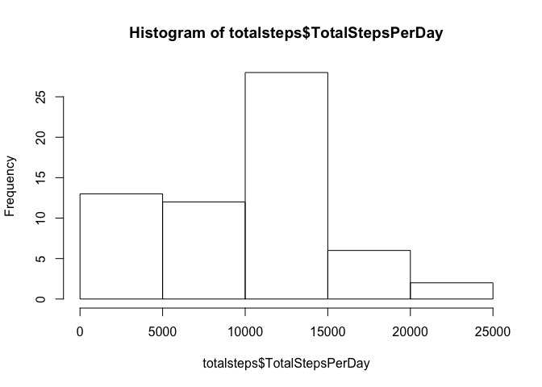
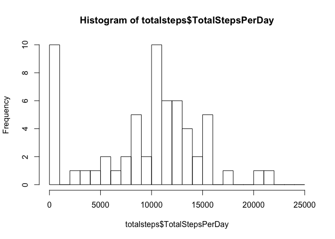
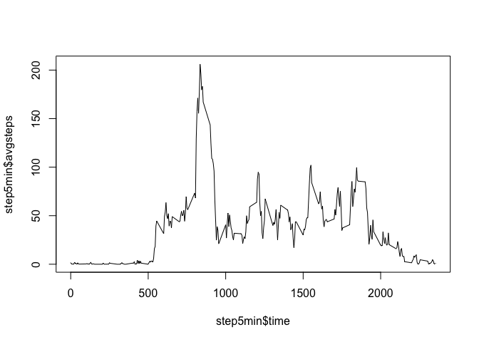
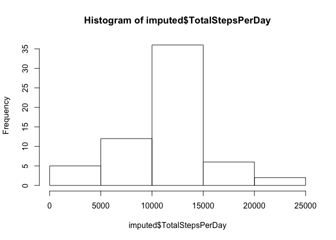
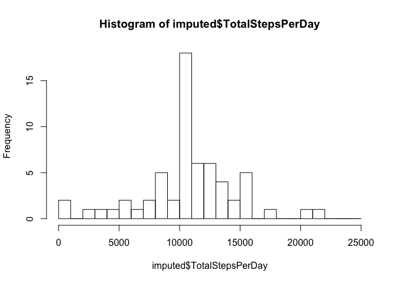
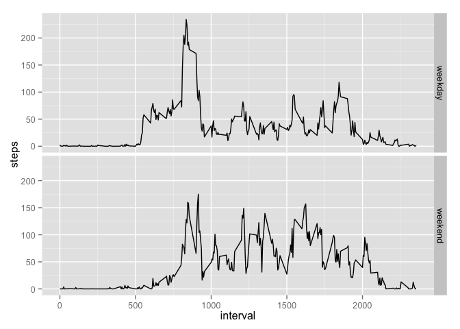

# Reproducible Research: Peer Assessment 1


## Loading and preprocessing the data

### Load the data using read.csv().

There are 3 columns of data.  The second column is to be imported as Date type.


```r
raw <- read.csv("activity.csv", header = TRUE, colClasses=c(NA,"Date",NA))
```

### Process/transform the data.

A new column *date2* is created using the function *as.Date()* to read in the format of *YYYY-mm-dd*


```r
raw$date2 <- as.Date(raw$date, "%Y-%m-%d")
str(raw)
```

```
## 'data.frame':	17568 obs. of  4 variables:
##  $ steps   : int  NA NA NA NA NA NA NA NA NA NA ...
##  $ date    : Date, format: "2012-10-01" "2012-10-01" ...
##  $ interval: int  0 5 10 15 20 25 30 35 40 45 ...
##  $ date2   : Date, format: "2012-10-01" "2012-10-01" ...
```

```r
head(raw)
```

```
##   steps       date interval      date2
## 1    NA 2012-10-01        0 2012-10-01
## 2    NA 2012-10-01        5 2012-10-01
## 3    NA 2012-10-01       10 2012-10-01
## 4    NA 2012-10-01       15 2012-10-01
## 5    NA 2012-10-01       20 2012-10-01
## 6    NA 2012-10-01       25 2012-10-01
```

## What is mean total number of steps taken per day?

For this part of the assignment, missing values (NA) are ignored.

### Calculate the total number of steps taken per day.

This is performed using *aggregate* function.


```r
totalsteps <- aggregate(raw$steps, by=list(raw$date2), FUN=sum, na.rm=TRUE)
colnames(totalsteps) <- c("Date", "TotalStepsPerDay")
str(totalsteps)
```

```
## 'data.frame':	61 obs. of  2 variables:
##  $ Date            : Date, format: "2012-10-01" "2012-10-02" ...
##  $ TotalStepsPerDay: int  0 126 11352 12116 13294 15420 11015 0 12811 9900 ...
```

```r
head(totalsteps)
```

```
##         Date TotalStepsPerDay
## 1 2012-10-01                0
## 2 2012-10-02              126
## 3 2012-10-03            11352
## 4 2012-10-04            12116
## 5 2012-10-05            13294
## 6 2012-10-06            15420
```

### Make a histogram of the total number of steps taken each day.

We created two histograms:

* The first histogram with default options

* The second histogram have breaks on every 1,000


```r
hist(totalsteps$TotalStepsPerDay)
```

 

```r
hist(totalsteps$TotalStepsPerDay, breaks=c(1000*0:25))
```

 

### Calculate and report the mean and median of the total number of steps taken per day.


```r
mean(totalsteps$TotalStepsPerDay)
```

```
## [1] 9354.23
```

```r
median(totalsteps$TotalStepsPerDay)
```

```
## [1] 10395
```

## What is the average daily activity pattern?

### Make a time series plot (i.e. type = "l") of the 5-minute interval (x-axis) and the average number of steps taken, averaged across all days (y-axis).

A table *step5min* is created to store the average number of steps taken for 5-minute interval, averaged across all days.


```r
step5min <- aggregate(raw$steps, by=list(raw$interval), FUN=mean, na.rm=TRUE)
colnames(step5min) <- c("time", "avgsteps")
head(step5min)
```

```
##   time  avgsteps
## 1    0 1.7169811
## 2    5 0.3396226
## 3   10 0.1320755
## 4   15 0.1509434
## 5   20 0.0754717
## 6   25 2.0943396
```


```r
plot(step5min$time, step5min$avgsteps, type="l")
```

 

An improvement in future needs to be made to the plot because the last value of each hour is 55, not 100. We need to take into account the transitions between 55 and 00 minutes. This is currently not a consideration in the plot above.


### Find out which 5-minute interval, on average across all the days in the dataset, contains the maximum number of steps.

The answer is 8:35 AM, as illustrated below.


```r
max(step5min$avgsteps)
```

```
## [1] 206.1698
```

```r
step5min[which(step5min$avgsteps == max(step5min$avgsteps)),]
```

```
##     time avgsteps
## 104  835 206.1698
```

## Imputing missing values

### Calculate and report the total number of missing values in the dataset (i.e. the total number of rows with NAs).

We find out any NA values in the table.


```r
anyNA(raw)
```

```
## [1] TRUE
```


We find out which columns has the NA values.


```r
head(subset(raw, is.na(steps)))
```

```
##   steps       date interval      date2
## 1    NA 2012-10-01        0 2012-10-01
## 2    NA 2012-10-01        5 2012-10-01
## 3    NA 2012-10-01       10 2012-10-01
## 4    NA 2012-10-01       15 2012-10-01
## 5    NA 2012-10-01       20 2012-10-01
## 6    NA 2012-10-01       25 2012-10-01
```

```r
head(subset(raw, is.na(date)))
```

```
## [1] steps    date     interval date2   
## <0 rows> (or 0-length row.names)
```

```r
head(subset(raw, is.na(interval)))
```

```
## [1] steps    date     interval date2   
## <0 rows> (or 0-length row.names)
```

The NAs appeared in the *steps* column only.

### Devise a strategy for filling in all of the missing values in the dataset.

We use the mean for that 5-minute interval to fill in the data.

### Create a new dataset that is equal to the original dataset but with the missing data filled in.  

We created a new data frame called *filled*.  We added a new average step column to *filled* by using *merge* function.


```r
filled <- merge(raw, step5min, by.x = "interval", by.y = "time")
str(filled)
```

```
## 'data.frame':	17568 obs. of  5 variables:
##  $ interval: int  0 0 0 0 0 0 0 0 0 0 ...
##  $ steps   : int  NA 0 0 0 0 0 0 0 0 0 ...
##  $ date    : Date, format: "2012-10-01" "2012-11-23" ...
##  $ date2   : Date, format: "2012-10-01" "2012-11-23" ...
##  $ avgsteps: num  1.72 1.72 1.72 1.72 1.72 ...
```

```r
head(filled,30)
```

```
##    interval steps       date      date2 avgsteps
## 1         0    NA 2012-10-01 2012-10-01 1.716981
## 2         0     0 2012-11-23 2012-11-23 1.716981
## 3         0     0 2012-10-28 2012-10-28 1.716981
## 4         0     0 2012-11-06 2012-11-06 1.716981
## 5         0     0 2012-11-24 2012-11-24 1.716981
## 6         0     0 2012-11-15 2012-11-15 1.716981
## 7         0     0 2012-10-20 2012-10-20 1.716981
## 8         0     0 2012-11-16 2012-11-16 1.716981
## 9         0     0 2012-11-07 2012-11-07 1.716981
## 10        0     0 2012-11-25 2012-11-25 1.716981
## 11        0    NA 2012-11-04 2012-11-04 1.716981
## 12        0     0 2012-11-08 2012-11-08 1.716981
## 13        0     0 2012-10-12 2012-10-12 1.716981
## 14        0     0 2012-10-30 2012-10-30 1.716981
## 15        0     0 2012-11-26 2012-11-26 1.716981
## 16        0    47 2012-10-04 2012-10-04 1.716981
## 17        0     0 2012-11-27 2012-11-27 1.716981
## 18        0     0 2012-10-31 2012-10-31 1.716981
## 19        0     0 2012-11-18 2012-11-18 1.716981
## 20        0     0 2012-10-05 2012-10-05 1.716981
## 21        0     0 2012-10-14 2012-10-14 1.716981
## 22        0     0 2012-10-23 2012-10-23 1.716981
## 23        0     0 2012-11-19 2012-11-19 1.716981
## 24        0     0 2012-10-11 2012-10-11 1.716981
## 25        0     0 2012-10-15 2012-10-15 1.716981
## 26        0     0 2012-10-06 2012-10-06 1.716981
## 27        0     0 2012-11-11 2012-11-11 1.716981
## 28        0     0 2012-11-29 2012-11-29 1.716981
## 29        0     0 2012-11-02 2012-11-02 1.716981
## 30        0     0 2012-10-07 2012-10-07 1.716981
```

We find out all the rows which are NAs and filled it with the average step.


```r
NArows <- which(is.na(filled$steps))
filled[NArows,2] <- filled[NArows,5]
```

We did extra checking to ensure no NAs in the data fame *filled*.


```r
which(is.na(filled$steps))
```

```
## integer(0)
```

```r
anyNA(filled)
```

```
## [1] FALSE
```

```r
head(filled,30)
```

```
##    interval     steps       date      date2 avgsteps
## 1         0  1.716981 2012-10-01 2012-10-01 1.716981
## 2         0  0.000000 2012-11-23 2012-11-23 1.716981
## 3         0  0.000000 2012-10-28 2012-10-28 1.716981
## 4         0  0.000000 2012-11-06 2012-11-06 1.716981
## 5         0  0.000000 2012-11-24 2012-11-24 1.716981
## 6         0  0.000000 2012-11-15 2012-11-15 1.716981
## 7         0  0.000000 2012-10-20 2012-10-20 1.716981
## 8         0  0.000000 2012-11-16 2012-11-16 1.716981
## 9         0  0.000000 2012-11-07 2012-11-07 1.716981
## 10        0  0.000000 2012-11-25 2012-11-25 1.716981
## 11        0  1.716981 2012-11-04 2012-11-04 1.716981
## 12        0  0.000000 2012-11-08 2012-11-08 1.716981
## 13        0  0.000000 2012-10-12 2012-10-12 1.716981
## 14        0  0.000000 2012-10-30 2012-10-30 1.716981
## 15        0  0.000000 2012-11-26 2012-11-26 1.716981
## 16        0 47.000000 2012-10-04 2012-10-04 1.716981
## 17        0  0.000000 2012-11-27 2012-11-27 1.716981
## 18        0  0.000000 2012-10-31 2012-10-31 1.716981
## 19        0  0.000000 2012-11-18 2012-11-18 1.716981
## 20        0  0.000000 2012-10-05 2012-10-05 1.716981
## 21        0  0.000000 2012-10-14 2012-10-14 1.716981
## 22        0  0.000000 2012-10-23 2012-10-23 1.716981
## 23        0  0.000000 2012-11-19 2012-11-19 1.716981
## 24        0  0.000000 2012-10-11 2012-10-11 1.716981
## 25        0  0.000000 2012-10-15 2012-10-15 1.716981
## 26        0  0.000000 2012-10-06 2012-10-06 1.716981
## 27        0  0.000000 2012-11-11 2012-11-11 1.716981
## 28        0  0.000000 2012-11-29 2012-11-29 1.716981
## 29        0  0.000000 2012-11-02 2012-11-02 1.716981
## 30        0  0.000000 2012-10-07 2012-10-07 1.716981
```

### Make a histogram of the total number of steps taken each day. 


```r
imputed <- aggregate(filled$steps, by=list(filled$date2), FUN=sum, na.rm=TRUE)
imputed
```

```
##       Group.1        x
## 1  2012-10-01 10766.19
## 2  2012-10-02   126.00
## 3  2012-10-03 11352.00
## 4  2012-10-04 12116.00
## 5  2012-10-05 13294.00
## 6  2012-10-06 15420.00
## 7  2012-10-07 11015.00
## 8  2012-10-08 10766.19
## 9  2012-10-09 12811.00
## 10 2012-10-10  9900.00
## 11 2012-10-11 10304.00
## 12 2012-10-12 17382.00
## 13 2012-10-13 12426.00
## 14 2012-10-14 15098.00
## 15 2012-10-15 10139.00
## 16 2012-10-16 15084.00
## 17 2012-10-17 13452.00
## 18 2012-10-18 10056.00
## 19 2012-10-19 11829.00
## 20 2012-10-20 10395.00
## 21 2012-10-21  8821.00
## 22 2012-10-22 13460.00
## 23 2012-10-23  8918.00
## 24 2012-10-24  8355.00
## 25 2012-10-25  2492.00
## 26 2012-10-26  6778.00
## 27 2012-10-27 10119.00
## 28 2012-10-28 11458.00
## 29 2012-10-29  5018.00
## 30 2012-10-30  9819.00
## 31 2012-10-31 15414.00
## 32 2012-11-01 10766.19
## 33 2012-11-02 10600.00
## 34 2012-11-03 10571.00
## 35 2012-11-04 10766.19
## 36 2012-11-05 10439.00
## 37 2012-11-06  8334.00
## 38 2012-11-07 12883.00
## 39 2012-11-08  3219.00
## 40 2012-11-09 10766.19
## 41 2012-11-10 10766.19
## 42 2012-11-11 12608.00
## 43 2012-11-12 10765.00
## 44 2012-11-13  7336.00
## 45 2012-11-14 10766.19
## 46 2012-11-15    41.00
## 47 2012-11-16  5441.00
## 48 2012-11-17 14339.00
## 49 2012-11-18 15110.00
## 50 2012-11-19  8841.00
## 51 2012-11-20  4472.00
## 52 2012-11-21 12787.00
## 53 2012-11-22 20427.00
## 54 2012-11-23 21194.00
## 55 2012-11-24 14478.00
## 56 2012-11-25 11834.00
## 57 2012-11-26 11162.00
## 58 2012-11-27 13646.00
## 59 2012-11-28 10183.00
## 60 2012-11-29  7047.00
## 61 2012-11-30 10766.19
```

```r
colnames(imputed) <- c("Date", "TotalStepsPerDay")
hist(imputed$TotalStepsPerDay)
```

 

```r
hist(imputed$TotalStepsPerDay, breaks=c(1000*0:25))
```

 

### Calculate and report the mean and median total number of steps taken per day.

```r
mean(imputed$TotalStepsPerDay)
```

```
## [1] 10766.19
```

```r
median(imputed$TotalStepsPerDay)
```

```
## [1] 10766.19
```

Conclusion: the mean and the median values differ from the first part of the assignment.  By imputing missing data, we have increased both mean and median values in this example.


## Are there differences in activity patterns between weekdays and weekends?

I use the dataset with the filled-in missing values for this part.

### Create a new factor variable in the dataset with two levels – “weekday” and “weekend” indicating whether a given date is a weekday or weekend day.

    

```r
library(plyr)
raw$weekcat <- weekdays(raw$date2, abbreviate = TRUE)
weekdata <- mutate(raw, daytype = ifelse(weekcat=="Sat"|weekcat=="Sun", "weekend", "weekday"))
str(weekdata)
```

```
## 'data.frame':	17568 obs. of  6 variables:
##  $ steps   : int  NA NA NA NA NA NA NA NA NA NA ...
##  $ date    : Date, format: "2012-10-01" "2012-10-01" ...
##  $ interval: int  0 5 10 15 20 25 30 35 40 45 ...
##  $ date2   : Date, format: "2012-10-01" "2012-10-01" ...
##  $ weekcat : chr  "Mon" "Mon" "Mon" "Mon" ...
##  $ daytype : chr  "weekday" "weekday" "weekday" "weekday" ...
```

###  Make a panel plot containing a time series plot (i.e. type = "l") of the 5-minute interval (x-axis) and the average number of steps taken, averaged across all weekday days or weekend days (y-axis). 

To make the time series plot, a new data frame needs to be prepared to contain 3 columns of data i.e. steps, daytype (weekend/weekday), and interval.


```r
attach(weekdata)
wd <- aggregate(steps, by=list(daytype, interval), FUN=mean, na.rm=TRUE)
colnames(wd) <- c("daytype", "interval", "steps")
detach(weekdata)
str(wd)
```

```
## 'data.frame':	576 obs. of  3 variables:
##  $ daytype : chr  "weekday" "weekend" "weekday" "weekend" ...
##  $ interval: int  0 0 5 5 10 10 15 15 20 20 ...
##  $ steps   : num  2.333 0 0.462 0 0.179 ...
```

The plot is then made using *ggplot* and *facet_grid*


```r
library(ggplot2)
p <- ggplot(wd, aes(interval, steps)) + geom_line()
p + facet_grid(daytype ~ .)
```

 

